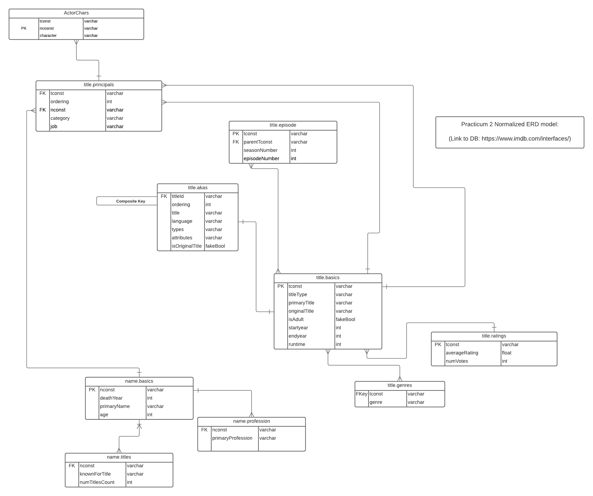
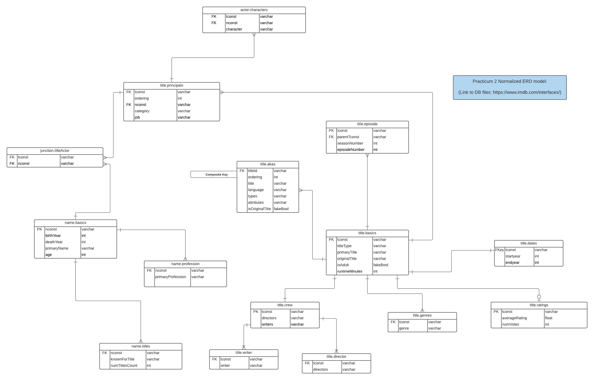

# Introduction

This practicum assignment creates a relational database using MySQL for the publicly available IMDB dataset. 

## ERD Diagrams

Rubric for this section:
- [x] (0 pts / 60 min) Inspect and then download IMDB movie data from https://www.imdb.com/interfaces/ (Links to an external site.)
. Read the descriptions of the data subsets and then download the compressed (gz) tab-separated files (tsv). If you cannot access the link, use this Canvas resource.
- [x] (10 pts) Read the data description and inspect the files, then:
    - [x] (5 pts / 60 min) create a data model in the form of an ERD in Crow's Foot notation using a tool of your choice (e.g., LucidChart, TOAD, MySQL Workbench, etc.) and embed an image of the model in your notebook. Your ERD should be a normalized model and not a direct representation of the data in the files. Later, when you load the data you will map the data from the files to the columns in the tables.
    - [x] (4 pts / 15 min) add junction/association tables to normalize many-to-many relationships, normalize multi-valued attributes, and create lookup tables for categorical attribute values. Embed an updated image of the model in your notebook.
    - [x] (1 pts / 5 min) add two new attributes (columns) to the appropriate tables: one for the age of a person and one for the number of movies a person has appeared in. Embed an updated image of the model in your notebook. Leave those columns empty for now. They will be filled in later.
    - [x] (2 pts / 10 min) ensure that the relational model is in at least BCNF; if a table should not be or cannot be in BCNF, then justify why not and provide a reason. Remember: no multi-valued attributes.


### Initial diagram
The following is an ERD diagram of the IMDB database after reading data description and normalization. 


### Ieration 1: Normalized diagram
The following is an ERD diagram of the IMDB database includes added attributes, junction and look-up tables. 



### Ieration 2: Normalized diagram
The following is an ERD diagram of the IMDB database includes added attributes, junction and look-up tables. 


We can guarantee this model represents the data in at least BCNF because it fulfills the requirements for all normal forms up to and including BCNF.
Exception: As mentioned in the Rubric - ```title.akas``` & ```title.principals``` are attempted to normalize but might be an exception due to the complexity.

First Normal Form: Each column contains atomic values.  
Second Normal Form: The table is in first normal form and all the columns depend on the table's primary key.  
Third Normal Form: The table is in second normal form and all of its columns are not transitively dependent on the primary key.  
BCNF: The table is in third normal form and for any dependency A -> B, A is a super key.

### R Setup

```{r dbconn}
#install.packages("DBI")
#install.packages("RMariaDB")
library(DBI)
library(RMariaDB)

db <- DBI::dbConnect(
  drv = RMariaDB::MariaDB(),
  dbname = "yourDB",
  host = "localhost",
  username = "yourUsername",
  password = "yourPassword"
)

knitr::opts_chunk$set(connection = "db")

# libraries
#install.packages("data.table")
#install.packages("tidyr")
#install.packages("dplyr")
#install.packages("stringr")
library(data.table)
library(tidyr)
library(dplyr)
library(stringr)

# add file paths from your local
fileTitleBasics <- "yourPath/title.basics.tsv"
fileNameBasics <- "yourPath/name.basics.tsv"
fileTitleRatings <- "yourPath/title.ratings.tsv"
fileTitleCrew <- "yourPath/title.crew.tsv"
fileTitleEpisode <- "yourPath/title.episode.tsv"
fileTitlePrincipals <- "yourPath/title.principals.tsv"
fileTitleAkas <- "yourPath/title.akas.tsv"
```


### CREATE TABLE Commands

Rubric for this section:
- [x] (8 pts / 60 min) Create and then run CREATE TABLE statements to build the schema. These statements must run from within your notebook and not from a separate script. Ensure proper referential integrity.

```{sql, connection="db"}
--
-- Table - titleBasics | File - title.basics.tsv
--
CREATE TABLE titleBasics (
    tconst VARCHAR(256) PRIMARY KEY,
    titleType VARCHAR(256),
    primaryTitle VARCHAR(256),
    originalTitle VARCHAR(256),
    isAdult SMALLINT,
    startYear SMALLINT,
    endYear SMALLINT,
    runtimeMinutes INT
);

```

```{sql, connection="db"}
--
-- Table - titleGenre
--
CREATE TABLE titleGenre (
	genreID INT PRIMARY KEY AUTO_INCREMENT,
    genre VARCHAR(256)
);

```

```{sql, connection="db"}
--
-- Table - juncTitleGenre 
--
CREATE TABLE juncTitleGenre (
	tconst VARCHAR(256),
    genreID INT,
    CONSTRAINT titleGenreFK FOREIGN KEY (tconst) REFERENCES titleBasics (tconst),
    CONSTRAINT genreFK FOREIGN KEY (genreID) REFERENCES titleGenre (genreID)
);

```

```{sql, connection="db"}
--
-- Table - titleRatings  | File - title.ratings.tsv
--
CREATE TABLE titleRatings (
	tconst VARCHAR(256),
    averageRating INT,
    numVotes INT,
    CONSTRAINT titleRatingFK FOREIGN KEY (tconst) REFERENCES titleBasics (tconst)
);

```

```{sql, connection="db"}
--
-- Table - titleEpisodes  | File - title.episodes.tsv
--
CREATE TABLE titleEpisodes (
	tconst VARCHAR(256) PRIMARY KEY,
    parentTconst VARCHAR(256),
    seasonNumber INT,
    episodeNumber INT,
    CONSTRAINT titleEpisodeFK FOREIGN KEY (parentTconst) REFERENCES titleBasics (tconst)
);

```

```{sql, connection="db"}
--
-- Table - crewRoles  | File - title.crew.tsv
--
CREATE TABLE crewRoles (
	roleID INT PRIMARY KEY AUTO_INCREMENT,
    role VARCHAR(256)
);
```

```{sql, connection="db"}
--
-- Table - juncCrewRole 
--
CREATE TABLE juncCrewRole (
	tconst VARCHAR(256),
    nconst VARCHAR(256),
    roleID INT,
    CONSTRAINT titleCrewFK FOREIGN KEY (tconst) REFERENCES titleBasics (tconst),
    CONSTRAINT roleCrewFK FOREIGN KEY (roleID) REFERENCES crewRoles (roleID)
);
```

```{sql, connection="db"}
-- Main table - nameBasics --

--
-- Table - nameBasics | File - name.basics.tsv
--
CREATE TABLE nameBasics (
	nconst VARCHAR(256) PRIMARY KEY,
	primaryName VARCHAR(256),
    birthYear SMALLINT,
    deathYear SMALLINT,
    age INT,
    numTitlesCount INT
);
```

```{sql, connection="db"}
--
-- Table - juncNameTitles
--
CREATE TABLE juncNameTitles (
	nconst VARCHAR(256),
    tconst VARCHAR(256),
    CONSTRAINT nameFK FOREIGN KEY (nconst) REFERENCES nameBasics (nconst),
    CONSTRAINT titleFK FOREIGN KEY (tconst) REFERENCES titleBasics (tconst)
);
```

```{sql, connection="db"}
--
-- Table - nameProfession
--
CREATE TABLE nameProfession (
	  professionID INT PRIMARY KEY AUTO_INCREMENT,
    primaryProfession VARCHAR(256)
);

```

```{sql, connection="db"}
--
-- Table - juncNameProfession
--
CREATE TABLE juncNameProfession (
	nconst VARCHAR(256),
    professionID INT,
    CONSTRAINT nameProfessionFK FOREIGN KEY (nconst) REFERENCES nameBasics (nconst),
    CONSTRAINT professionFK FOREIGN KEY (professionID) REFERENCES nameProfession (professionID)
);
```

```{sql, connection="db"}
--
-- Table - titlePrincipals | File - title.principals.tsv
--
CREATE TABLE titlePrincipals (
	tconst VARCHAR(256),
    ordering INT,
    nconst VARCHAR(256),
    category VARCHAR(256),
    job VARCHAR(256),
    characters VARCHAR(256),
    CONSTRAINT principalTitleFK FOREIGN KEY (tconst) REFERENCES titleBasics (tconst),
    CONSTRAINT principalNameFK FOREIGN KEY (nconst) REFERENCES nameBasics (nconst)
);
```

```{sql, connection="db"}
show tables;
```
## Load Data into the tables

Rubric for this section:
- [x] (10 pts / 120 min) Load the data from the downloaded data files into the tables. 
    - [x] Properly parse the foreign keys and attributes and ensure that the data is in the right tables in the right form and that referential integrity is ensured. This will require parsing code in your chosen programming language.
    - [x] You should create a subset of each dataset for testing (as the data sets are very large and take significant time to load).
    - [x] What is the effect of the referential integrity checking while you load? Can you do something about that? Describe and implement any improvement strategies.

### titleBasics, titleGenres, juncTitleGenre load
``` {r, connection="db"}
#pre-script

#read the file into a data.table
fread(fileTitleBasics, sep = "\t", header= TRUE, na.strings="\\N", nrows=50000)-> pre

# Extract genres and corresponding tconst from file and split into individual rows
genres <- pre[, list(tconst, genres)]
genresDF <- as.data.frame(genres)

#rename column name 'genres' to 'genre'
genresDF <- separate_rows(genresDF, tconst, genres, convert = TRUE)
renamedGenre <- genresDF %>% rename(genre = genres)
print(renamedGenre)

genreTableData <- distinct(subset(renamedGenre, select = -c(tconst)), genre)

#Remove the row  genres form the data.table
pre[, genres:=NULL]
preDF <- as.data.frame(pre)

#Insert data into MySQL Table
dbWriteTable(db, value = preDF, row.names = FALSE, name = "titleBasics", append = TRUE)
dbReadTable(db, "titleBasics")

#Insert data into titleGenre and create corresponding PK
dbWriteTable(db, value = genreTableData, row.names = FALSE, name = "titleGenre", append = TRUE)
genreWithID <- dbReadTable(db, "titleGenre")

#Merge dataframes to create the junction table data
junctionGenre <- merge(renamedGenre, genreWithID, by="genre", all.x = FALSE)
junctionGenre <- subset(junctionGenre, select = -c(genre))
print(junctionGenre)
dbWriteTable(db, value = junctionGenre, row.names = FALSE, name = "juncTitleGenre", append = TRUE)
dbReadTable(db, "juncTitleGenre")
```

### titleRatings load
``` {r, connection="db"}
fread(fileTitleRatings, sep = "\t", header= TRUE, na.strings="\\N", nrows=50000) -> ratings
ratingsDF <- as.data.frame(ratings)
dbWriteTable(db, value = ratingsDF, row.names = FALSE, name = "titleRatings", overwrite = TRUE)
dbReadTable(db, "titleRatings")
```

### crewRoles, juncCrewRole load
``` {r, connection="db"}
#This is to be considered for later

# read the file into a data.table
fread(fileTitleCrew, sep = "\t", header= TRUE, na.strings="\\N", nrows=50000)-> crew

# crew file consists of tconst, directors, & writers - latter two columns to be converted into a table
directors <- crew[, list(tconst, directors)]
writers <- crew[, list(tconst, writers)]
print(crew)

# separate and atomize the director and writer rows - 'roles' for crewRoles
directors <- separate_rows(directors, tconst, directors, convert = TRUE)
writers <- separate_rows(writers, tconst, writers, convert = TRUE)

print(directors)
print(writers)
```

### titleEpisodes load
``` {r, connection="db"}
fread(fileTitleEpisode, sep = "\t", header= TRUE, na.strings="\\N", nrows=50000) -> episodes
episodesDF <- as.data.frame(episodes)
head(episodesDF)
dbWriteTable(db, value = episodesDF, row.names = FALSE, name = "titleEpisodes", overwrite = TRUE)
dbReadTable(db, "titleEpisodes")
```

### nameBasics, juncNameProfession, nameProfession, knownForTitles load

```{r, connection="db"}
# initial import
nameData <- fread(fileNameBasics, sep = "\t", header= TRUE, na.strings="\\N", nrows=50000) 

# nameBasics table
nameBasics <- as.data.frame(nameData)


# pull out titles
knownForTitles <- nameData[, list(nconst, knownForTitles)]
knownForTitles <- separate_rows(knownForTitles, knownForTitles, nconst, convert = TRUE)
knownForTitles <- knownForTitles %>% rename(tconst = knownForTitles)


dbWriteTable(db, value = knownForTitles, row.names = FALSE, name = "juncNameTitles", overwrite = TRUE)
dbReadTable(db, "juncNameTitles")


# pull out professions
professions <- nameData[, list(nconst, primaryProfession)]

# seperate into atomic values
professions <- separate_rows(professions, primaryProfession, nconst, convert = TRUE)

# create distinct professions dataframe
distinctProfessions <- distinct(subset(professions, select = -c(nconst)), primaryProfession)

# insert data into titleProfession table
dbWriteTable(db, value = distinctProfessions, row.names = FALSE, name = "nameProfession", append = TRUE)
professionsWithID <- dbReadTable(db, "nameProfession")
print(professionsWithID)

# drop redundant columns
nameBasics = subset(nameBasics, select = -c(primaryProfession, knownForTitles))

# insert data into 'nameBasics' table
dbWriteTable(db, value = nameBasics, row.names = FALSE, name = "nameBasics", append = TRUE)
dbReadTable(db, "nameBasics")

# Merge data frames to create the junction table data
juncProfession <- merge(professions, professionsWithID, by="primaryProfession", all.x = FALSE)
juncProfession <- subset(juncProfession, select = -c(primaryProfession))

# write data to the junction table
dbWriteTable(db, value = juncProfession, row.names = FALSE, name = "juncNameProfession", append = TRUE)
dbReadTable(db, "juncNameProfession")
```

### titlePrincipals data load

```{r, connection="db"}

# initial import
principalsData <- fread(fileTitlePrincipals, sep = "\t", header= TRUE, na.strings="\\N", nrows=50000)

dbWriteTable(db, value = principalsData, row.names = FALSE, name = "titlePrincipals", overwrite=TRUE)
dbReadTable(db, "titlePrincipals")


```


## Queries

### Update statements and triggers for newly created columns

Rubric for this section:
- [x] (5 pts / 30 min) After loading the data, execute UPDATE statements for the two newly created columns in (2C). You may interpret what appearing in movies means and what you classify as movies -- just make it clear in your notebook.
- [x] (10 pts / 90 min) Add triggers to the appropriate tables so that the newly created columns in (2C) are automatically updated when new data in inserted.

```{r, connection="db"}

# Query to update age in the table.
ageQuery<-"UPDATE nameBasics
SET age = CASE
		WHEN deathYear IS NULL THEN YEAR(CURRENT_TIMESTAMP) - birthYear + 1
        ELSE deathYear - birthYear + 1
	END"

dbExecute(db, ageQuery)

dbReadTable(db, "nameBasics")

```


```{r, connection="db"}

# Query to update number of titles from junction table in the 'nameBasics' table
titlesQuery<-"UPDATE nameBasics AS t
INNER JOIN (
  SELECT s.nconst, COUNT(*) AS count
  FROM juncNameTitles AS s
  -- WHERE s.custom_condition IS (true)
  GROUP BY s.nconst
) AS aggregate ON aggregate.nconst = t.nconst
SET t.numTitlesCount = aggregate.count;"

dbExecute(db, titlesQuery)

dbReadTable(db, "nameBasics")

```


```{sql, connection="db"}
--
-- TRIGGER for updating 'numTitlesCount'
--


```


### View for actors and their attributes

Rubric for this section:
- [ ] (8 pts / 60 min) Create a view that lists the name of each actor, their age, whether they are dead or not, and how many movies they are known for.

```{r, connection="db"}
actorViewQuery <- "CREATE VIEW actorAttView AS
SELECT primaryName as Name, age as Age, (if(deathYear IS NULL, 'FALSE', 'TRUE')) as isDead, numTitlesCount as NumberOfMovies
FROM nameBasics;"

dbExecute(db, actorViewQuery)

fetchActorViewQuery <- "SELECT * FROM actorattview;"

dbGetQuery(db, fetchActorViewQuery)
```

### Query for number of seasons for each TV series with a histogram plot

Rubric for this section:
- [x] (9 pts / 90 min) Write a query that finds the number of seasons for each TV series. Using the results of the query create a histogram (frequency plot) with proper axis labels and title.

```{r, connection="db"}
noOfSeasonsQuery <- "SELECT t.parentTconst as Id, b.primaryTitle as Title, MAX(t.seasonNumber) as NumberOfSeasons
FROM titleEpisodes as t, titleBasics as b
WHERE t.parentTconst = b.tconst AND b.titleType = 'tvSeries'
GROUP BY t.parentTconst
ORDER BY t.parentTconst;"

noOfSeasonsResult <- dbGetQuery(db, noOfSeasonsQuery)
noOfSeasonsResult <- na.omit(noOfSeasonsResult)
print(noOfSeasonsResult)

hist(noOfSeasonsResult$NumberOfSeasons, 
     main="Histogram for Number of Seasons for TV Series", 
     xlab="Seasons",
     ylab="Frequency of seasons",
     border="darkgray", 
     col="aliceblue",
     breaks=10)
```


### Stored Procedure to add actor and delete actor from the database

Rubric for this section:
- [ ] (10 pts / 120 min) Build a function in your code or a stored procedure in the database (approach is your choice) called addActor() that adds a new actor to the database: this requires updating several tables, so the insertions must occur within a transaction in order to function properly in a concurrent environment. Test your function by inserting a new actor -- you may make up a name and associated information. Show evidence  in your notebook that the actor was properly inserted.
- [ ] (5 pts / 60 min) Build a function in your code or a stored procedure in the database (approach is your choice) called deleteActor() that removes an actor from the database: this requires updating several tables, so the deletions must occur within a transaction in order to function properly in a concurrent environment. Test your function by deleting a new actor inserted in (9) -- show evidence that the removal was successful.


### Query to retrieve actors with two or more movies and above average rating

Rubric for this section:
- [x] (10 pts / 45 min) Write a query to retrieve the names and ages of all actors who appeared in more than two movies (but not TV Movies) which an above average rating. Show the results of the query in your notebook. Do not hard code the average rating.

```{r, connection="db"}
aboveAvgActorQuery <- "SELECT n.primaryName, n.age
FROM (SELECT * 
FROM nameBasics as n
RIGHT JOIN (
	SELECT j.nconst as id
	FROM juncNameProfession as j, nameProfession as p
	WHERE j.professionID = p.professionID AND p.primaryProfession = 'actor'
    ) as p
ON n.nconst = p.id) as n
INNER JOIN (
	SELECT j.nconst as id, COUNT(j.tconst) as numAboveAvgMovies
	FROM juncNameTitles as j
	INNER JOIN (
		SELECT t.tconst as titleID, t.averageRating, b.titleType as type
		FROM titleRatings as t
		RIGHT JOIN titleBasics as b
		ON t.tconst = b.tconst AND b.titleType = 'movie'
		WHERE t.averageRating > ( SELECT avg(averageRating) FROM titleRatings )
	) AS m
	ON j.tconst = m.titleID
	GROUP BY j.nconst) as i
ON n.nconst = i.id AND i.numAboveAvgMovies > 2;"

dbGetQuery(db, aboveAvgActorQuery)

```

### Query to retrieve actor by name, query analysis and indexing
Rubric for this section:
- [ ] (5 pts / 90 min) Write a query that finds an actor by name (pick a name). Measure the execution time of the query. Then create an index that would improve the performance of the query and then run and measure it again. Show the difference in a bar chart and comment on why that's the case.

### Add indexes to several tables, performance measurements and line graph for one, two, three index
Rubric for this section:
- [ ] (5 pts / 90 min) Add several indexes to a table of your choice (one containing lots of rows) and then insert additional rows into the table. Provide measurements of insert performance with no additional index, one, two, three, etc. Plot the performance change in a line graph and comment on the difference.


